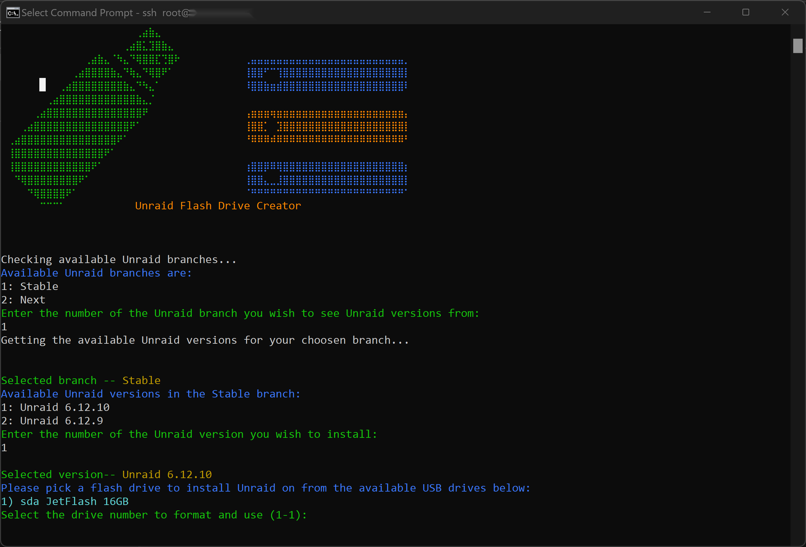

# Unraid Data Center Setup Script

This is a script designed to automate the setup of an Unraid server on a USB flash drive in a data center environment, specifically tailored for Hetzner or similar providers. It simplifies the process of downloading Unraid, preparing a USB drive, and making it bootable.

*(Of course script doesn't need to be run in data center and can be run at home on any Ubuntu based distro to download Unraid to a flash drive and make it bootable)*

## Prerequisites for data center install

- A dedicated server rented from a data center (e.g., Hetzner).
- A USB flash drive connected to the server.
- Booted either into rescue system or Ubuntu Server installed on the server with SSH access enabled.

## Script Usage

### Step-by-Step Guide

1. **Request USB Flash Drive Installation**: Contact your data center support to have a USB flash drive installed in your server if not already present.

2. **Run Rescue System or Ubuntu**: Use the data center's control panel (e.g., Hetzner's Robot  Console) to run the recuse system os, or alternatively install Ubuntu Server. Connect by SSH

3.  **Download and Prepare the Script**: You will need `curl` installed to download the script directly to your server:

Copy the  command below and paste it your terminal. This will download the script and make it executable. 

```bash
curl -o install.sh https://raw.githubusercontent.com/SpaceinvaderOne/DataCenter_Unraid_Installer/main/unraid_data_center.sh && chmod +x install.sh
```

 4.  **Run the Script**:
    
If you are logged in as root (as you would be with rescue system on Hetzner) run script without sudo 
```bash
 bash ./install.sh 
```

If you are not root user you must use sudo 
```bash
 sudo bash ./install.sh
```

 5.  **Follow the prompts to configure and execute the script**:



**Choose Unraid branch**: Select the branch Stable, Next or Upload and restore from backup (to restore from backup see notes)\
**Choose Unraid version**: The script will list latest available Unraid versions from the branch. Select which to install.\
**Select USB Drive**: The script will list the USB drives connected.Select the one you want to use. This drive will be formatted and used to install Unraid, so ensure that no critical data is on the drive.\
**Confirm Data Erasure**: The script will warn you that all data on the USB drive will be erased and ask for confirmation to proceed.\
**UEFI Boot Mode**: Sript will show you the current boot mode of server, you'll be asked to enable or disable UEFI boot mode as necessary.
    
6.  **Reboot and Set Boot Priorities**: After the script completes, reboot the server through the data center's control panel. Ensure the USB drive is set as the primary boot device.

7.  **Access the Unraid GUI**: Once the server boots from the USB drive, open port 80 on the firewall temporarily and access the Unraid GUI using the server's IP address.

### Notes

-   If you cannot access the Unraid GUI after reboot, check the server's boot settings to ensure it is set to boot from USB. You may need to contact data center support for help or book a KVM session to adjust the boot settings manually.

-   To restore your Unraid flashdrive on your data center server. When asked to choose branch select 9: Upload and restore from backu. You will be asked for a link for the script to download the zip file.
choose 1 to user Dropbox link. Upload your zip backup to Dropbox and copy the public link and paste link when asked.
choose 2 to use a direct link to zip file (test this in a browser first to check file downloads) 
Currently only cloud storage supported is Dropbox. 
